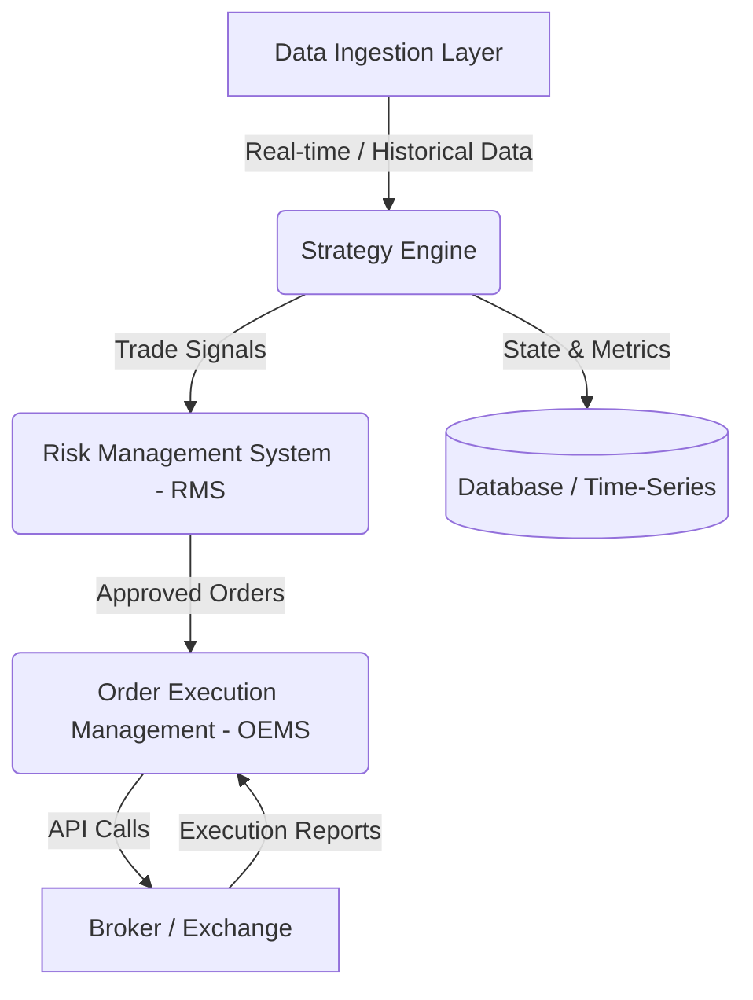

# Algorithmic Trading System

This repository contains the architecture, code, and strategies for our algorithmic trading system. To ensure absolute portability and context preservation, all design decisions, configuration templates, and setup playbooks are version-controlled directly within this repository.

---

## 0. Roles, Responsibilities & Guidelines

### Team Roles
*   **Human Founder:** Vision, strategy direction, risk parameters, business goals, and final design approval.
*   **Technical Co-founder (AI):** Owns technical architecture, system design, implementation, and code quality. Assists with technical and non-technical decisions/tasks as needed.

### Operating Guidelines
*   **Simple & Flexible Architecture:** Prioritize decoupled, modular components over complex, over-engineered designs.
*   **Non-Vague & Minimal Documentation:** Consolidate design plans, notes, and decisions into a single central source of truth (`README.md` and basic templates) to maintain clarity and avoid documentation bloat.
*   **Proactive Technical Ownership:** The Technical Co-founder proactively proposes solutions, manages technical debt, and ensures code is clean and production-ready.

---

## 1. System Architecture Blueprint

We design the system using a highly modular, decoupled architecture to ensure we can switch brokers, data feeds, or databases without rewriting core strategy code.

### Core Components
1.  **Data Ingestion Layer:** Ingests live tick/order-book data and historical bars.
2.  **Strategy Engine:** Houses quantitative and statistical trading models.
3.  **Risk Management System (RMS):** Evaluates orders against risk parameters (drawdown limits, size limits) before routing.
4.  **Order Execution Management (OEMS):** Handles order routing, lifecycle tracking, and broker API translation.
5.  **Database/Storage:** Stores tick data, performance metrics, and transaction logs.

---

## 2. Portability & Context Preservation Strategy

To guarantee that the project can be moved to any environment (local, cloud VM, different IDE) without losing context or breaking:

*   **Documentation in Repo:** All design decisions, functional specs, and runbooks live in `docs/` and as Architectural Decision Records (ADRs) under `adr/`.
*   **Containerization:** The application stack is containerized using Docker to eliminate "works on my machine" issues.
*   **Environment Isolation:** No secrets or environment-specific paths are hardcoded. Configurations are driven by a `.env` file (based on `.env.example`).
*   **Interface Abstractions:** Critical external interfaces (Brokers, Data Feeds, Databases) are defined via abstract classes/interfaces so concrete implementations can be swapped seamlessly.

---

## 3. Technology Stack Decisions (Pending)

*   **Asset Class:** *To be decided* (e.g., Crypto, Equities, Options)
*   **Primary Language:** *To be decided* (e.g., Python for speed of development/ML, Rust/C++ for execution speed)
*   **Data Providers:** *To be decided*
*   **Broker/Exchange:** *To be decided*
*   **Storage Solution:** *To be decided*

---

## 4. Next Steps

1.  Align on the initial target asset class and trading frequency.
2.  Select the programming language and core packages.
3.  Initialize the project layout and Docker configuration.
